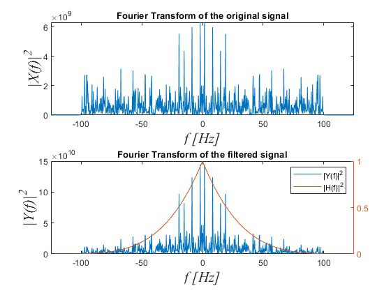
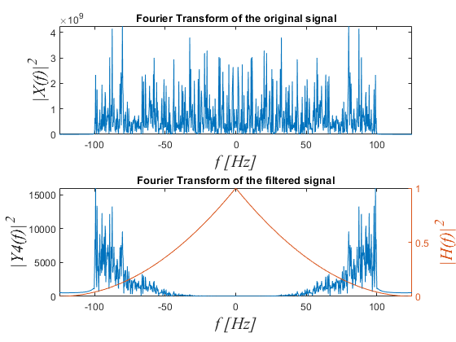

# MATLAB Signal Processing Project

This project explores the application of fundamental signal processing techniques, including Fast Fourier Transform (FFT) and FIR filtering, to analyze and manipulate signals in the frequency domain. It involves generating 3000 random cosine waves with varying amplitudes and frequencies, applying filters to remove specific frequency components, and visualizing the impact of filtering on the signal.

## Project Objectives

The main objectives of this project are:
1. **Signal Generation**: Create 3000 random cosine waves with frequency ranges of \( |f| < 100 \) Hz and amplitude ranges of \( |a| < 10 \) and \( |b| < 30 \).
2. **Frequency Domain Analysis**: Analyze the frequency characteristics of the signal using FFT.
3. **Filtering Techniques**: Apply bandstop FIR and custom frequency-domain filters to remove unwanted frequency components.
4. **Visualization**: Demonstrate the effects of filtering on the signal in both time and frequency domains.

## Code Overview

### Task 1: Signal Generation and Fourier Transform

- Generate 3000 random cosine waves with frequency and amplitude variations.
- Sum the signals and plot the Fourier Transform within the frequency range of -125 Hz to 125 Hz.

### Task 2: FIR Bandstop Filter

- Implement a bandstop FIR filter to remove frequencies in the range of 20 Hz to 40 Hz.
- Visualize the frequency response and the effect of the filter on the signal.

### Task 3: Frequency Domain Filtering

- Apply a custom frequency domain filter \( H(f) = (1 - |f|/125)^2 \) to attenuate specific frequency components.
- Plot both the original and filtered signals in the frequency domain.

### Task 4: Linear-Combination Filter Design (LCCD)

- Design a Linear-Combination Filter to apply specific filtering characteristics.
- Visualize the filtered signal in the frequency domain and compare it with the original.

## Outputs and Visualizations

    <figure>
        
        <figcaption>Fourier Transform of the Generated Signal</figcaption>
    </figure>
    <figure>
        
        <figcaption>FIR Bandstop Filter Response</figcaption>
    </figure>

    <figure>
        
        <figcaption>Effect of Custom Frequency Domain Filter</figcaption>
    </figure>
    <figure>
        
        <figcaption>Linear Combination Filter Design (LCCD)</figcaption>
    </figure>

## Conclusion

This project demonstrates the process of signal generation, filtering, and analysis in the frequency domain using MATLAB. By applying both time-domain and frequency-domain filtering techniques, it showcases how specific frequency components can be isolated or removed, highlighting the importance of filtering in applications like audio processing and communication systems.

---

Feel free to clone this repository and explore the MATLAB code to deepen your understanding of these signal processing techniques.
